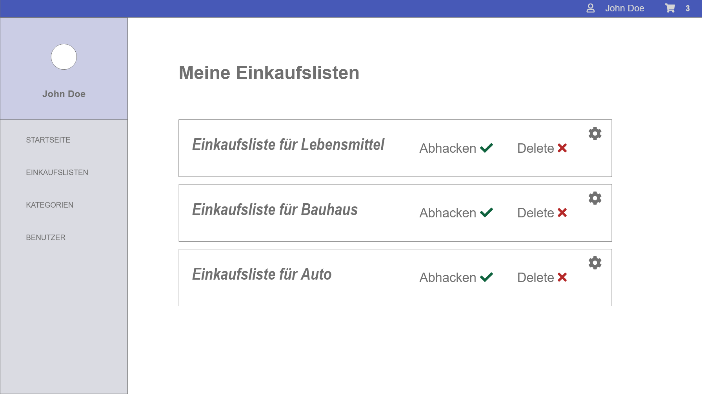

# Shopping List App
ShoppingList App using ASP. NET Core, Razor Pages and Bootstrap with Code first approach.

## Requirements
* .NET Core 2.2 - https://dotnet.microsoft.com/download/dotnet-core/2.2
* EntityFrameWork Core NuGet - https://www.nuget.org/packages/Microsoft.EntityFrameworkCore/
* SqlLocalDB - https://www.microsoft.com/en-us/download/confirmation.aspx?id=29062

## Setup
1. Change the Property value of the property DefaultConnection in appsettings.json,
  to match with the Connection String of your local Database Instance or Published Database.
2. Run following Commands in NuGet console: 
   * dotnet restore
   * Update-Database
3. Run the Shopping_List_App Project with IIS or publish it as an Azure AppService.

